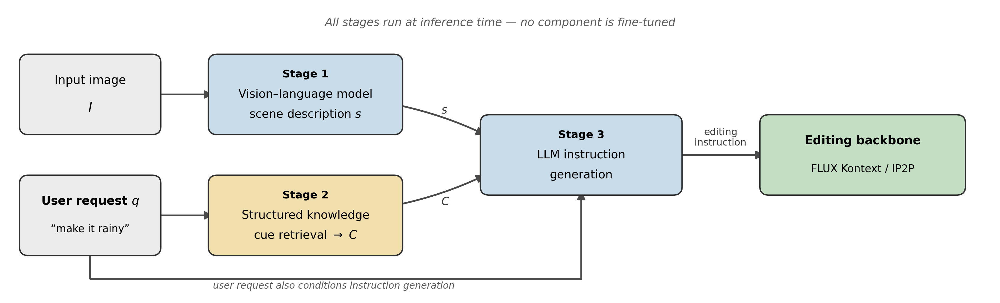
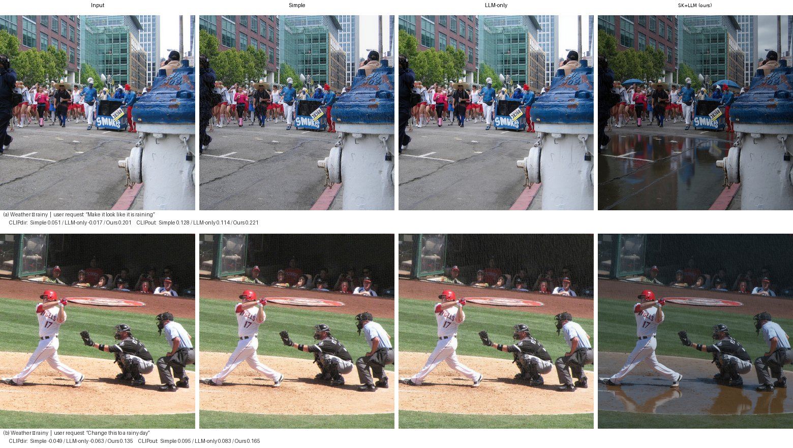
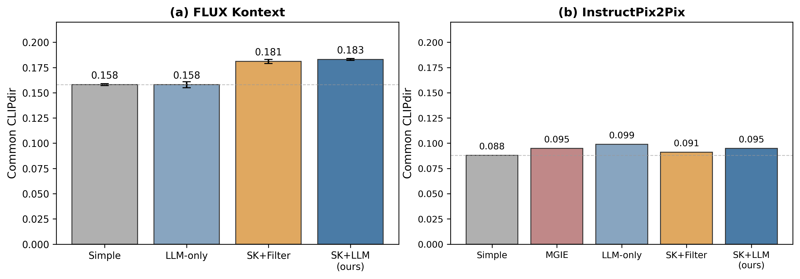

# Training-Free Structured Knowledge-Augmented Instruction Generation for Image Editing

A training-free image-editing pipeline that expands a short user request with scene-grounded visual cues retrieved from a structured knowledge repository. The generated instruction is passed to an off-the-shelf editor without task-specific fine-tuning.

<p align="center">
  
</p>

## Overview

Short requests such as *“make it rainy”* often provide too little visual detail for an editing model. This project adds an explicit instruction-generation layer:

1. a vision-language model describes the visible scene;
2. deterministic keyword and alias matching retrieves condition-specific cues;
3. an LLM combines the scene, request, and cues into one concise editing instruction;
4. FLUX Kontext or InstructPix2Pix performs the edit.

The released repository contains **21 condition entries**, **5 typed cue slots**, and **498 visual cues**. No component is fine-tuned for this task.

## Qualitative results

<p align="center">
  
</p>

On both rainy-condition examples, **Simple** and **LLM-only** leave the scene largely unchanged. **SK+LLM** supplies concrete condition-specific cues, leading FLUX Kontext to introduce wet surfaces, puddles, reflections, and darker lighting while retaining the main scene structure. The panel is the same qualitative figure used in the manuscript (FLUX Kontext, seed 42).

*The source images are from the Emu Edit test set and remain under CC BY-NC 4.0; this manuscript panel is included for non-commercial research demonstration and attribution.*

## Main results

### FLUX Kontext

Mean ± standard deviation across seeds 42, 123, and 777. CLIPdir uses 107 valid samples; the other metrics use all 110 samples.

| Method | CLIPdir ↑ | CLIPout ↑ | CLIPim ↑ | L1 ↓ | DINO ↑ |
|---|---:|---:|---:|---:|---:|
| Simple | 0.158 ± .001 | 0.180 ± .001 | 0.854 ± .004 | 0.255 ± .003 | 0.855 ± .006 |
| LLM-only | 0.158 ± .003 | 0.177 ± .001 | **0.867 ± .002** | **0.240 ± .002** | **0.881 ± .005** |
| SK+Filter | 0.181 ± .002 | 0.192 ± .001 | 0.831 ± .003 | 0.292 ± .002 | 0.817 ± .005 |
| **SK+LLM** | **0.183 ± .001** | **0.199 ± .001** | 0.804 ± .001 | 0.301 ± .002 | 0.775 ± .002 |

Against LLM-only, SK+LLM improves:

- **CLIPdir by +0.025**; 95% CI `[+0.013, +0.038]`, paired Wilcoxon `p = 0.002`.
- **CLIPout by +0.022**; 95% CI `[+0.015, +0.029]`, `p < 0.001`.

LLM-only rewriting is nearly identical to the raw request on target alignment. The improvement appears when structured cues are introduced. Stronger directional editing is accompanied by lower preservation, making edit strength and preservation an explicit trade-off.

### InstructPix2Pix

Single seed 42. CLIPdir uses 99 valid samples; the other metrics use all 128 samples.

| Method | CLIPdir ↑ | CLIPout ↑ | CLIPim ↑ | L1 ↓ | DINO ↑ |
|---|---:|---:|---:|---:|---:|
| Simple | 0.088 | 0.208 | **0.896** | 0.172 | **0.870** |
| MGIE | 0.095 | 0.211 | 0.881 | **0.162** | 0.826 |
| **LLM-only** | **0.099** | 0.212 | 0.865 | 0.185 | 0.809 |
| SK+Filter | 0.091 | 0.212 | 0.864 | 0.183 | 0.804 |
| **SK+LLM** | 0.095 | **0.213** | 0.870 | 0.184 | 0.820 |

All ten pairwise comparisons are non-significant for both CLIPdir and CLIPout. The IP2P experiment therefore supports **competitive application without fine-tuning or architectural modification**, not a significant universal gain across editors.

> **Numerical archive note.** The archived IP2P records store each sample metric to four decimal places. Re-averaging those rounded records gives SK+Filter L1 = `0.183484`, which displays as `0.183` under standard three-decimal rounding, while the manuscript table reports `0.184`. The original full-precision per-sample values are not available, so the repository preserves both the manuscript value and the archived records rather than modifying either. All other table means agree at three decimals.

<p align="center">
  
</p>

## Cross-backbone interpretation

The two evaluations preserve the same structured repository and four instruction conditions, but they use **editor-specific inference configurations**:

| Component | FLUX Kontext | InstructPix2Pix |
|---|---|---|
| Scene model | LLaVA-1.5-7B | MGIE-associated LLaVA-7B-v1 |
| Scene prompt | Detailed 3–5 sentence template | IP2P/MGIE-specific description template |
| Instruction system prompt | Names FLUX Kontext | Names InstructPix2Pix |
| Reasoning handling | Post-process reasoning tags | Closed reasoning-block prefill |
| Generated instructions | Generated for FLUX | Independently regenerated for IP2P |

Consequently, comparisons **within** each backbone are controlled, while the FLUX–IP2P comparison is descriptive rather than a causal isolation of the editing backbone. The 102-sample matched subset controls sample composition only. See [`docs/experiment_protocol.md`](docs/experiment_protocol.md).

## Repository contents

```text
.
├── assets/                     # README figures
├── data/                       # repository, captions, sample IDs, annotations
├── docs/                       # prompts, protocol, reproduction scope
├── results/
│   ├── raw/                    # sample-level records behind the paper tables
│   ├── overall_metrics.csv
│   ├── condition_clipdir.csv
│   ├── statistical_tests.csv
│   └── matched_subset.csv
├── src/sk_editing/             # reusable retrieval, prompt, I/O, result utilities
├── scripts/
│   ├── generate_flux.py
│   ├── generate_ip2p.py
│   ├── recompute_metrics.py
│   ├── export_results.py
│   └── self_check.py
├── analysis/statistics.py      # bootstrap confidence intervals and Wilcoxon tests
└── figures/                    # figure-generation utilities
```

The archived result files retain the original workspace field names. [`results/README.md`](results/README.md) maps them to the paper labels.

## Quick verification

Python 3.10 or later is recommended.

```bash
git clone https://github.com/hojunparkme/sk-instruction-editing.git
cd sk-instruction-editing
python -m venv .venv
source .venv/bin/activate        # Windows: .venv\Scripts\activate
pip install -e .

python analysis/statistics.py
python scripts/export_results.py
python scripts/self_check.py
```

`self_check.py` validates the repository structure, knowledge counts, sample selections, result schemas, reported means, paired statistics, prompt documentation, README links, placeholders, secrets, and Python syntax.

## Full generation

Install the GPU dependencies:

```bash
pip install -e ".[generation]"
```

### FLUX Kontext

```bash
python scripts/generate_flux.py \
  --image-root /path/to/emu-edit-assets \
  --output-dir runs/flux \
  --seeds 42 123 777

python scripts/recompute_metrics.py runs/flux/manifest.json --device cuda
```

### InstructPix2Pix and MGIE

Obtain the official MGIE repository and checkpoints separately, then run:

```bash
python scripts/generate_ip2p.py \
  --image-root /path/to/emu-edit-assets \
  --output-dir runs/ip2p \
  --mgie-code /path/to/ml-mgie \
  --mgie-llava /path/to/LLaVA-7B-v1 \
  --mgie-checkpoint /path/to/mgie_7b/mllm.pt

python scripts/recompute_metrics.py runs/ip2p/manifest.json --device cuda
```

Apart from the manuscript qualitative panel in `assets/qualitative_results.png`, source images and generated image files are not redistributed. Model weights and MGIE code are also not redistributed. The scripts are cleaned reference implementations; the included sample-level records are the source of truth for the reported numerical tables. See [`docs/reproducibility.md`](docs/reproducibility.md).

## Evaluation design

- **CLIPdir:** cosine similarity between the image-space edit direction and the same sample-specific Emu Edit caption direction for every method.
- **CLIPout:** output-image similarity to one fixed caption per target condition.
- **CLIPim, L1, DINO:** preservation of the input image.
- **FLUX statistics:** seed-level scores are averaged per sample before sample-level paired tests.
- **Uncertainty:** 10,000 bootstrap resamples and paired Wilcoxon signed-rank tests.

The fixed CLIPout captions are in [`data/clipout_captions.json`](data/clipout_captions.json), and every prompt template is documented in [`docs/prompts.md`](docs/prompts.md).

## Implementation and research contributions

- Designed and organized a typed, condition-indexed visual knowledge repository.
- Implemented deterministic cue retrieval and scene-grounded instruction generation.
- Built four controlled instruction conditions and an explicit cue-filtering ablation.
- Evaluated the framework on FLUX Kontext and InstructPix2Pix.
- Designed a shared-reference CLIPdir protocol that does not reward methods for generating longer instructions.
- Performed sample-level paired statistical testing and matched-subset analysis.

## Data and licensing

`data/emu_edit_weather_final.json` is a filtered and annotated derivative of the Emu Edit test set and remains under **CC BY-NC 4.0**. It contains annotations only; source images are not included. Code is released under MIT. Model weights and third-party code retain their original licenses.

See [`data/NOTICE.md`](data/NOTICE.md) for attribution and the exact modifications made to the annotations.

## Citation

The manuscript citation can be updated after publication. The repository itself can be cited through [`CITATION.cff`](CITATION.cff).
